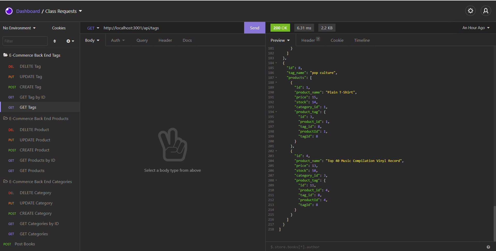

# e-commerce_back_end
[](https://opensource.org/licenses/MIT)

This is an application that allows a user to use express and sequelize in order to access data in a mySQL database which contains data on various products categories and tags. A user may also view update, create and delete entries as they see fit. to alter the data base


## Installation

Installations required: [node.js](https://nodejs.org/en/), [mysql](https://www.mysql.com/), [Insomnia](https://insomnia.rest/)


After installing the required components you want to clone this repository into your system

  ```
  git clone git@github.com:EajayD/e-commerce_back_end.git
  ```

  Then you want to install the npm package 

  ```
  npm i 
  ```
Next you will want to change directory into the db folder and run the following commands below in order to get the initial foundation for the database

```
mysql -u root -p
source schema.sql
```

After returning to the root of the repo, run the command below to populate the database

```
node seeds/index.js
```

After you will want to create a .env file and copy and paste the template below and just fill out your password (DB_PW) for your mysql

  ```
DB_USER= 'root'
DB_PW= ''
DB_NAME='ecommerce_db'
  ```
Once that is complete you can run the command below to connect to the server and database and play with the database in Insomnia

```
node server.js
```

## Usage

After running the node server.js, the user can now go into Insomnia and use the following routes using the GET function, to get all data associated with the key word. Using the POST function in insomnia will allow you to create additional entries using this pathway

```
http://localhost:3001/api/categories
http://localhost:3001/api/products
http://localhost:3001/api/tags
```
Below is a preview of the GET route for the tags keyword



Additionally you can also fine tune the search for GET by tacking on an ID after the key word as shown below. You can also update through PUT and delete entries by DELETE by specifying the ID as well
```
http://localhost:3001/api/categories/1
http://localhost:3001/api/products/2
http://localhost:3001/api/tags/3
```

The video below is a small walkthrough of how the application behaves in Insomnia and how you could possibly use each route and how it affects the data

[Video link](https://drive.google.com/file/d/1Ms32tMyFXz06EowpqOdoFxR8N1yJm3Du/view)


## Built With

* [Git](https://git-scm.com/about)
* [Github](https://github.com/)
* [Javascript](https://developer.mozilla.org/en-US/docs/Web/JavaScript)
* [Node.js](https://nodejs.org/en/docs/)
* [MYSQL](https://www.mysql.com/)
* [Express.js](https://www.npmjs.com/package/express) 
* [Sequelize](https://www.npmjs.com/package/sequelize) 
* [Dotenv](https://www.npmjs.com/package/dotenv)
* [Insomnia](https://insomnia.rest/)


## Authors

* **Eajay Delos Santos** 

    - [Link to Github](https://github.com/EajayD)
    - [Link to LinkedIn](https://www.linkedin.com/in/eajay-delos-santos-912950214/)

## License

 [MIT License](https://opensource.org/licenses/MIT)

